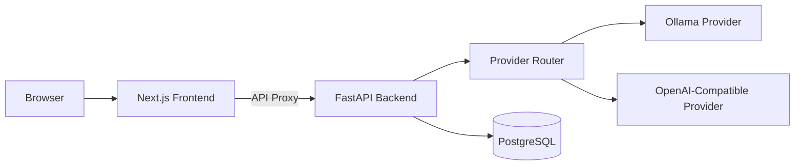

# OpenChat Architecture

## Overview

OpenChat is a monorepo fullstack AI chat system with a Next.js frontend, a FastAPI backend, PostgreSQL persistence, and pluggable model providers (Ollama and OpenAI-compatible APIs).

## High-Level Topology

## Monorepo Boundaries

- `frontend/`: UI, client state, and API proxy routes.
- `backend/`: API routes, services, repositories, provider adapters, and DB models.
- Root-level orchestration: `docker-compose.yml`, shared `.env.example`, CI workflows, and optional local helper scripts under `scripts/`.

## Backend Design

### Layered Architecture

- **API Routes** (`backend/app/api/routes`): request validation and HTTP concerns.
- **Services** (`backend/app/services`): chat orchestration, streaming, title derivation, attachment handling, and extension hooks.
- **Provider Router** (`backend/app/services/provider_router.py`): provider/model dispatch.
- **Providers** (`backend/app/providers`): streaming adapters for Ollama and OpenAI-compatible APIs with normalized chunk output.
- **Repositories** (`backend/app/repositories`): persistence and query boundaries.
- **Models + Schemas** (`backend/app/models`, `backend/app/schemas`): DB and contract definitions.

### Streaming Contract

- Endpoint: `POST /api/v1/chat/stream`
- Uses async generators and `StreamingResponse`.
- Providers normalize stream chunks so frontend consumes one unified plain-text stream.

### Persistence Model

- `chat_sessions`: session identity, title, timestamps.
- `chat_messages`: session-bound messages with role, content, provider, model, created timestamp.
- Async SQLAlchemy + Alembic migrations for schema lifecycle.

### Extension Hooks

- RAG hook: `retrieve_context(query: str) -> str`
- Agent hook: `run_tool(query: str)`

These hooks are intentionally lightweight integration points for future retrieval/tool execution pipelines.

## Frontend Design

### State and Data Flow

- Zustand store tracks:
  - `sessionId`
  - `messages`
  - `selectedProvider`
  - `selectedModel`
  - `isStreaming`
  - `error`
- UI streams tokens progressively and updates the draft assistant message in place.

### API Proxy Boundary

- Frontend never calls backend directly from client components.
- Proxy routes in `frontend/src/app/api` forward:
  - `/api/chat`
  - `/api/models`
  - `/api/sessions`

## Security Posture (Balanced)

- Frontend markdown renderer blocks dangerous link schemes.
- Backend enforces payload size and attachment constraints.
- Backend applies safe HTTP response headers middleware.

## Quality Gates

- Backend: unit + integration tests.
- Frontend: unit + component tests.
- Browser E2E: Playwright flow coverage (mocked API; no full Docker/Ollama required in CI).
- CI deploy gate blocks image builds unless all prerequisite tests pass.
