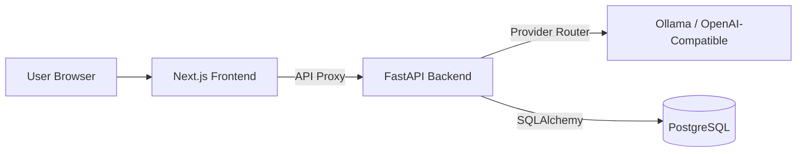
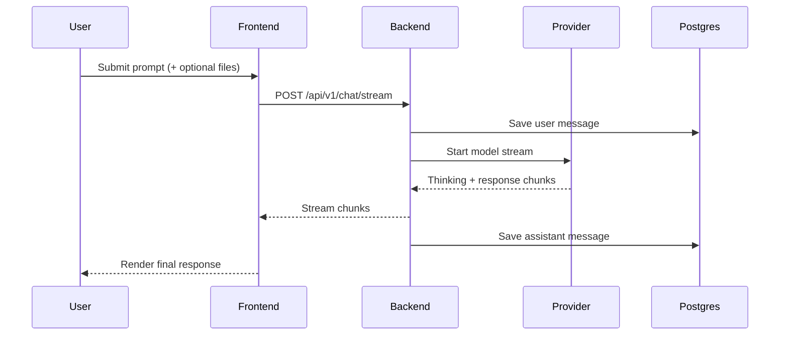

# 💬 OpenChat

<div align="center">


**A clean, self-hosted AI chat platform with streaming responses, thinking view, provider routing, and persistent sessions**

[Features](#-features) • [Architecture](#-architecture) • [Technology Stack](#-technology-stack) • [Installation](#-installation) • [Usage](#-usage) • [API](#-api-reference) • [Testing](#-testing) • [CI/CD](#-cicd)

</div>

---

## ✨ Features

### 🎯 Core Capabilities

- **⚡ Streaming Responses** - Token-by-token assistant output with responsive UI updates.
- **🧠 Thinking Visibility** - Collapsible reasoning blocks with a dedicated thinking toggle.
- **🗂️ Session Management** - Create, restore, rename, and delete sessions with persistence.
- **🧩 Multi-Provider Routing** - Supports `ollama` and `openai_compatible` model backends.
- **📎 File & Image Attachments** - Send text and image context directly with prompts.
- **🛡️ Self-Hosted by Default** - Run completely local with Docker and local models.

### 🎨 User Experience

- **🌑 Dark-First Interface** - Minimal, modern chat workspace focused on readability.
- **📝 Markdown + Code Rendering** - Rich assistant output with syntax-highlighted code blocks.
- **📊 Token Estimates** - Per-message and per-session token summaries.
- **🎲 Dynamic Streaming Status** - Fun randomized status messages outside active thinking phase.

### 🔧 Engineering Quality

- **✅ Strict Backend Tests** - Providers, services, schemas, and routing logic are covered.
- **✅ Strict Frontend Tests** - API mapping, state store behavior, and parsing logic are covered.
- **🚦 CI/CD Gates** - Push/PR tests plus deploy gate checks for `main`.

---

## 🧭 Architecture

### High-Level Overview



### Chat Request Flow



---

## 🛠️ Technology Stack

### Frontend

- **Next.js 15** (App Router + API routes)
- **React 18** + **TypeScript**
- **Zustand** for state management
- **Tailwind CSS** for UI styling
- **Vitest** for unit tests

### Backend

- **FastAPI**
- **Python 3.11+**
- **SQLAlchemy + Alembic**
- **PostgreSQL**
- **HTTPX** for provider clients
- **Pytest + pytest-asyncio**

### Infrastructure

- **Docker + Docker Compose**
- **GitHub Actions** (`test.yml`, `deploy.yml`)

---

## 📋 Requirements

### System

- **Node.js** 20+
- **Python** 3.11+
- **Docker** + Docker Compose
- **Ollama** (optional, if using host model runtime)

### Runtime

- PostgreSQL 16-compatible environment
- Local or remote model endpoint compatible with configured providers

---

## 🚀 Installation

### Quick Start

1. **Clone repository**

   ```bash
   git clone <your-repo-url>
   cd OpenChat
   ```

2. **Configure environment files**

   ```bash
   cp .env.example .env
   cp backend/.env.example backend/.env
   cp frontend/.env.example frontend/.env
   ```

3. **Start stack**

   ```bash
   docker compose --env-file .env up --build -d
   ```

4. **Open app**
   - Frontend URL is controlled by `FRONTEND_PORT` in `.env`.

### Alternate Docker Modes

**Bridge mode**

```bash
# in .env
# COMPOSE_FILE=docker-compose.yml:docker-compose.bridge.yml

docker compose --env-file .env up --build -d
```

**Ollama container profile**

```bash
docker compose --env-file .env --profile ollama up --build -d
```

---

## 💻 Usage

1. Choose a provider and model.
2. Start a new chat and send your prompt.
3. Optionally attach files/images using the `+` button.
4. Toggle thinking mode depending on your preference.
5. Manage sessions from sidebar menu (rename/delete).

---

## 🔌 API Reference

### Chat

- `POST /api/v1/chat/stream`

### Sessions

- `GET /api/v1/sessions`
- `POST /api/v1/sessions`
- `PATCH /api/v1/sessions/{id}`
- `DELETE /api/v1/sessions/{id}`
- `GET /api/v1/sessions/{id}/messages`

### Models

- `GET /api/v1/models`

---

## 🧪 Testing

### Backend

```bash
cd backend
python -m venv .venv
source .venv/bin/activate
pip install -r requirements.txt
pytest -q
```

### Frontend

```bash
cd frontend
npm ci
npm test
```

---

## 🚦 CI/CD

### `test.yml`

- Runs on **every push** (all branches).
- Runs on **every pull request**.
- Executes backend and frontend tests independently.

### `deploy.yml`

- Runs on **push to `main`**.
- Runs backend and frontend tests first.
- Builds backend and frontend Docker images.
- Pulls and validates Postgres image used by compose.
- Final gate succeeds only if all test/build jobs pass.

---

## 📁 Project Structure

```text
.
├── backend/                         # FastAPI app + providers + persistence
├── frontend/                        # Next.js app + API proxy
├── docker-compose.yml               # Base stack
├── docker-compose.bridge.yml        # Bridge network overlay
├── docker-compose.host-ollama.yml   # Host Ollama overlay
└── .github/workflows/
    ├── test.yml
    └── deploy.yml
```

---

## Acknowledgments

- [FastAPI](https://fastapi.tiangolo.com/)
- [Next.js](https://nextjs.org/)
- [Ollama](https://ollama.com/)
- [PostgreSQL](https://www.postgresql.org/)
- [Docker](https://www.docker.com/)
