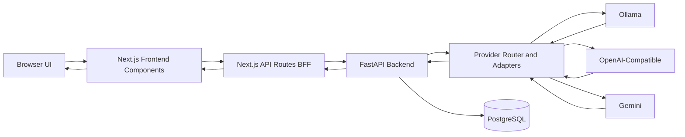
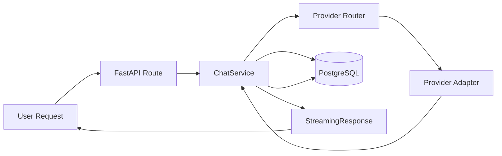
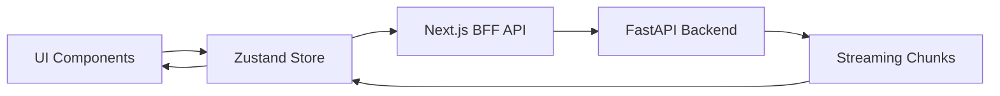

# OpenChat Master Document

### Mermaid Diagram (System Overview)

---

## 3. DETAILED ARCHITECTURE (FRONTEND + BACKEND)

### Mermaid Diagram (Backend Flow)

### Mermaid Diagram (Frontend Streaming Loop)

---
